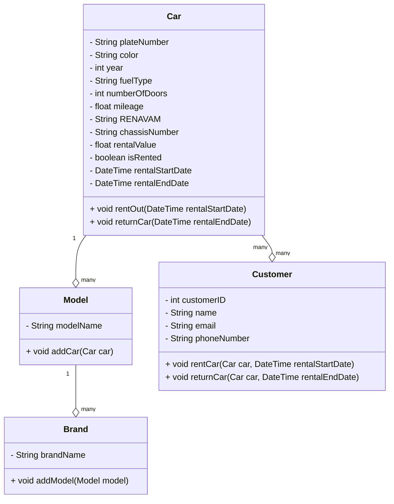

## Diagrama de Classes

```mermaid
classDiagram
    class Car {
        - String plateNumber
        - String color
        - int year
        - String fuelType
        - int numberOfDoors
        - float mileage
        - String RENAVAM
        - String chassisNumber
        - float rentalValue
        - boolean isRented
        - DateTime rentalStartDate
        - DateTime rentalEndDate
        + void rentOut(DateTime rentalStartDate)
        + void returnCar(DateTime rentalEndDate)
    }

    class Model {
        - String modelName
        + void addCar(Car car)
    }

    class Brand {
        - String brandName
        + void addModel(Model model)
    }

    class Customer {
        - int customerID
        - String name
        - String email
        - String phoneNumber
        + void rentCar(Car car, DateTime rentalStartDate)
        + void returnCar(Car car, DateTime rentalEndDate)
    }

    Car "1"--o "many" Model
    Model "1"--o "many" Brand
    Car "many"--o "many" Customer
```
